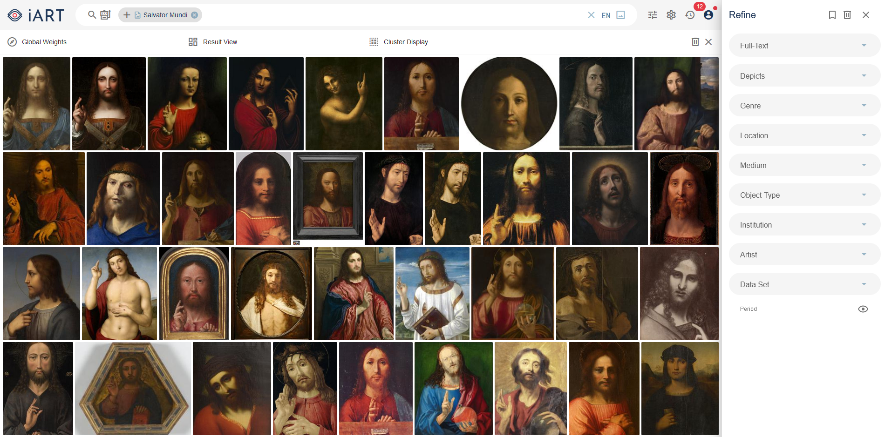

# *iART* – An Interactive Analysis- and Retrieval-Tool for the Support of Image-Oriented Research Processes




## Overview

The project *iART* is devoted to the development of an e-Research-tool for digitized, image-oriented research processes in the humanities and cultural sciences. It not only aims to improve the efficiency of retrieval in image databases but also offers various tools for analyzing image data, thereby enhancing scientific work and facilitating new theory formation. The motivation for the project stems from the fundamental importance of the comparative approach in art history, which targets the similarity of pictures and comes along with a rehabilitation of similarity thinking in contemporary philosophy of science. *iART* is supposed to transfer the approach of art history theorists and practitioners of Comparative Analysis to the digital age, and to extend it by virtue of modern information technology. 


## Installation

At a later point there will be a docker container provided here.


## Development setup

### Requirements
* [docker](https://docs.docker.com/get-docker/)
* [docker-compose](https://docs.docker.com/compose/install/)

### Setup process
1. Clone the *iART* repository including submodules:
    ```sh
    git clone --recurse-submodules https://github.com/TIBHannover/iart.git
    cd iart
    ```

2. Download and extract models:
    ```sh
    wget https://tib.eu/cloud/s/idRNbs6EJ5LKea6/download/models_cpu.tar.gz
    tar -xf models_cpu.tar.gz --directory data
    ```


## About the project

*iART* was funded by the [DFG](https://gepris.dfg.de/gepris/projekt/415796915) from 2019 to 2021. Our team consists of [Matthias Springstein](https://www.tib.eu/de/forschung-entwicklung/visual-analytics/mitarbeiterinnen-und-mitarbeiter/matthias-springstein/), [Stefanie Schneider](https://www.kunstgeschichte.uni-muenchen.de/personen/wiss_ma/schneider/index.html), [Javad Rahnama](https://www.hni.uni-paderborn.de/ism/mitarbeiter/155385986504753/), [Ralph Ewerth](https://www.tib.eu/de/forschung-entwicklung/visual-analytics/mitarbeiterinnen-und-mitarbeiter/ralph-ewerth/), [Hubertus Kohle](https://www.kunstgeschichte.uni-muenchen.de/personen/professoren_innen/kohle/index.html), and [Eyke Hüllermeier](https://www.hni.uni-paderborn.de/ism/mitarbeiter/112491383000284/).


## Contributing

Please report issues, feature requests, and questions to the [GitHub issue tracker](https://github.com/TIBHannover/iart/issues).
